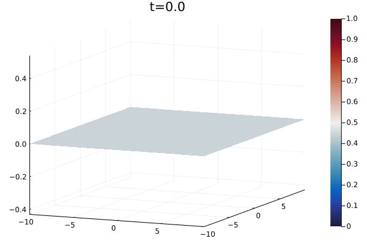

# Neural Field Equations

[](https://travis-ci.com/tiagoseq/NeuralFieldEq.jl)
[](https://ci.appveyor.com/project/tiagoseq/NeuralFieldEq-jl)
[](https://codecov.io/gh/tiagoseq/NeuralFieldEq.jl)
[](https://coveralls.io/github/tiagoseq/NeuralFieldEq.jl?branch=master)

Deterministic equation with delay:

<a href="https://www.codecogs.com/eqnedit.php?latex=\alpha&space;\frac{\partial&space;V}{\partial&space;t}\left(\mathbf{x},t\right)&space;=&space;I\left(\mathbf{x},t\right)&space;-&space;V\left(\mathbf{x},t\right)&space;&plus;&space;\int_{\Omega}&space;K\left(||\mathbf{x}-\mathbf{y}||_2\right)S\big[V\left(\mathbf{y},t-d\left(\mathbf{x},\mathbf{y}\right)\right)\big]\,\,d^2\mathbf{y}" target="_blank"></a>

Stochastic equation with delay:


where the domain <a href="https://www.codecogs.com/eqnedit.php?latex=\inline&space;\Omega" target="_blank"></a> is of the form <a href="https://www.codecogs.com/eqnedit.php?latex=\inline&space;[-\frac{L}{2},\frac{L}{2}]^d,d=1,2" target="_blank"></a>.

# Numerical solver for deterministic or stochastic NFE with or without delay in 1D and 2D

A numerical method was developed to solve SNFEs within the scope of the thesis "Numerical simulations of one- and two-dimensional stochasticneural field equations with delay", under the supervision of professor Pedro M. Lima.
In the deterministic case it was implemented the novel numerical method published originally by A. Hutt and N. Rougier [1,2]. Regarding the stochastic case, the approach taken was to combine the mentioned work [1,2] with the Galerkin-type method developed by C. Kuehn and M. Riedler [3], where the authors derive a spectral method to handle with stochastic neural fields with additive noise, <a href="https://www.codecogs.com/eqnedit.php?latex=\inline&space;\large&space;\epsilon" target="_blank"></a>, and spatial correlation, <a href="https://www.codecogs.com/eqnedit.php?latex=\inline&space;\large&space;\xi" target="_blank"></a>.

With respect to time discretisation, the scheme implemented is the explicit Euler (deterministic case) and the analogous Euler-Maruyama (stochastic case). More numerical are to be added, such as the second order scheme presented in [4] (deterministic case) and the Milstein method and the Itô-Taylor Expansion (stochastic case). In space the Fast Fourier Transforms were used to compute the solution.

[1] A. Hutt and N. Rougier - "Numerical simulation scheme of one and two-dimensional neural fields involving space-dependent delays"

[2] A. Hutt and N. Rougier - "Neural Field Simulator: two-dimensional spatio-temporal dynamics involving finite transmission speed"

[3] C. Kuehn and M.Riedler - "Large Deviations for Nonlocal Stochastic Neural Fields"

[4] P. Lima and E. Buckwar - "Numerical Solution of the Neural Field Equation in the Two-Dimensional Case"

## Dependencies

`FFTW.jl`, `Distributions.jl` and `LinearAlgebra.jl`.

## Installation

To install the package, type on the Julia REPL the following:
```julia
using Pkg
Pkg.add("NeuralFieldEq")
```

## Solving neural field equations

To setup correctly the neural field problem the functions external input, connectivity kernel and firing rate functions (I, K and S) need to be properly defined. If the external input does not depend on time or if it is constant, the arguments must always be `x` and `t` (1D) or `x`, `y` and `t` (2D). Regarding K, the arguments are only the spacial variables `x` (1D) or `x` and `y` (2D). The firing rate is defined as `S(V)`, regardless the dimensionality of the problem in study.

With respect to the parameters of the NFE &#x2014; `α`-decay rate, `v`-velocity, `V0`-initial condition, `L`-domain's length, `N`-number of spatial nodes, `T`-time span, `n`-number of time nodes &#x2014; they must be wraped in this order, along with I, K and S, in the structures `Input1D` or `Input2D` to be passed as input to the function `probNFE`, where the data is prepared to solve the NFE, using the function `solveNFE`. A small remark, to work with the non-delayed problem, the velocity to insert must satisfy the condition: `v>L/(sqrt(2)*Δt)` in 2D and `v>L/(2*Δt)` in 1D.

Example:

```julia
input = Input1D(α,v,V0,L,N,T,n,I,K,S); # Wrap the inputs in structure Input1D
data  = probNFE(Input1D)               # Prepare data
Vdet  = solveNFE(data,[t1,t2,t3])      # solve the deterministic 1D problem and save the solution at t1, t2, and t3

# solve the stochastic 1D problem np times with ϵ level of additive noise, spatial correlation (0.1 default value) and save the solution at t1, t2, and t3
Vsto  = solveNFE(data,[t1,t2,t3],ϵ,np,ξ=0.1)
```

We show some examples to better illustrate the correct usage of the numerical solver.

The following example shows an one-dimensional neural field:
```julia
using NeuralFieldEq # Pre-compile the package

### Defining the inputs
extInput(x,t) = t<=1 ? -2.89967 + 8.0*exp(-x^2/(2.0*3^2)) - 0.5 : -2.89967              # External input
kernel(x)     = 2*exp(-0.08*sqrt(x^2))*(0.08*sin(pi*sqrt(x^2)/10)+cos(pi*sqrt(x^2)/10)) # Connectivity function
firingRate(V) = convert(Float64,V>0.0) # Heavyside function H(V)                        # Firing rate. Heavyside function H(V)

α  = 1.0   # Constant decay      (must be float)
v  = 20.0  # Finite axonal speed (must be float)
V0 = 0.0   # Initial condition (can be a constant or a function)
L  = 100   # Domain length     (can be a integer or float)
N  = 512   # Number of nodes to discretise space (must be integer)
T  = 20.0  # Time span (must be float)
n  = 200   # Number of nodes to discretise time  (must be integer)
###

### Prepare the data to be solved
in_1D   = Input1D(α,v,V0,L,N,T,n,extInput,kernel,firingRate); # Wrap the inputs in structure Input1D
prob_1D = probNFE(in_1D) # Prepare the data to solve the NFE

### Compute the deterministic solution
tj   = [5.0,10.0,20.0]      # Choose the time instants where the solution is saved
V_1D = solveNFE(prob_1D,tj) # Solve the equation and save at tj instants
```
The function `probNFE` returns some useful information of the problem in study:


The stochastic version of the same neural field can be computed by 
```julia
# Solve the stochastic equation with ϵ = 0.05 and ξ=0.1
# for 100 trajectories and save at tj instants
Vsto_1D = solveNFE(prob_1D,tj,0.05,100) # ξ default value is 0.1 (spatial correlation)

# Choosing another value for ξ 
Vsto2_1D = solveNFE(prob_1D,tj,0.05,100,0.15) # ξ = 0.15
```

A 2D version of this example can be setted using the structure `Input2D` and the functions I, K and S with the proper arguments:
```julia
# In 2D we have 2 spacial variables, x and y
extInput(x,y,t) = t<=1 ? -2.89967 + 8.0*exp(-x^2-y^2/(2.0*3^2)) - 0.5 : -2.89967
kernel(x,y)     = 2*exp(-0.08*sqrt(x^2+y^2))*(0.08*sin(pi*sqrt(x^2+y^2)/10)+cos(pi*sqrt(x^2+y^2)/10))

in_2D   = Input2D(α,v,V0,L,N,T,n,extInput,kernel,firingRate); # Wrap the inputs in structure Input2D
prob_2D = probNFE(in_2D) # Prepare the data to solve the NFE

### Compute the two-dimensional solutions
V_2D    = solveNFE(prob_2D,tj) # deterministic
Vsto_2D = solveNFE(prob_2D,tj,0.05,100) # stochastic
```

## Handling solutions

Considering `t=[t1,t2,t3]`, to access the deterministic solution at `t2`, the user must type `V(t2)` or `V(2)` (the index of `t2` is 2).

In the stochastic case, the procedure is the same. Note that if the user only specifies the time instant, for example `Vsto(t3)`, then it will be returned the mean solution at `t3`. Whereas to choose a trajectory p at a certain time, the command should be `Vsto(t3,p)`, as an example, for the 27th trajectory at `t3`.

Moreover, to help plotting the solutions, the output of the function `solveNFE` is endowed with the fields `x`, `y` (in 2D case), and `tsaved` (instants where the solution was saved), corresponding to the discretised spatial and time variables, respectively.

Considering the 1D example:
```julia
using Plots
x = V_1D.x

p1 = plot(x,V_1D(1),title="Det solution at t=5",xlabel="x",ylabel="Action potential") # V_1D(1) == V_1D(5.0) returns a vector
p2 = plot(x,Vsto_1D(5.0),title="Mean solution at t=5",xlabel="x",ylabel="Action potential")
p3 = plot(x,Vsto_1D(5.0,4),title="Trajectory 4 at t=5",xlabel="x",ylabel="Action potential") # V_1D(5.0,4) == V_1D(1,4)
plot(p1,p2,p3)
```


## Examples

```julia
using NeuralFieldEq

function W(x)
    if x != 0
        return (((1-exp(-1.8*abs(x)))*(3.5/1.8) + (-1+exp(-1.52*abs(x)))*(3/1.52))*x)/abs(x)
    else

        return 0.0
    end
end
a2   = 2.28978
sole(x) = W(x) - W(x-a2)

extInput(x,t) = 0.0
kernel(x) = 3.5*exp(-1.8*abs(x))-3*exp(-1.52*abs(x))
firingRate(V) = convert(Float64,V>0.0) # Heavyside function H(V)

α  = 1.0
v  = 90000.0 # This velocity satisfies the condition v>L/(2*Δt), thus we are considering the non-delayed problem
V0 = sole    # The initial condition, V0, is a function
L  = 20
N  = 512
T  = 20.0
n  = 200

input = Input1D(α,v,V0,L,N,T,n,extInput,kernel,firingRate);
prob  = probSNFE(input)
V     = solveSNFE(prob,[0.2,1.0,5.0,10.0,20.0])         # Compute the deterministic solution
Vsto  = solveSNFE(prob,[0.2,1.0,5.0,10.0,20.0],0.05,50) # Compute the stochastic solution 50 times with ϵ = 0.05 and ξ=0.1
```

```julia
using NeuralFieldEq, Plots

### Defining inputs
I(x,y,t) = (5.0/(32.0*pi))*exp(-(x^2+y^2)/32.0)
function K(x,y)
    A = 20.0/(10.0*pi)
    B = 14.0/(18.0*pi)
    return A*exp(-sqrt(x^2+y^2)) - B*exp(-sqrt(x^2+y^2)/3.0)
end
S(V) = convert(Float64,V>0.005) # Heavyside function H(V-Vthresh)

α  = 1.0
v  = 5.0
V0 = 0.0
L  = 20
N  = 256
T  = 10.0
n  = 200

### Prepare the data
input = Input2D(α,v,V0,L,N,T,n,I,K,S);
prob  = probSNFE(input)

### Solve the neural field equation
tj = 0:0.2:T;
V    = solveNFE(prob,tj)          # Deterministic solution
Vsto = solveNFE(prob,tj,0.001,50) # Stochastic solution

### Plots
t = V.tsaved
maxmin_V = zeros(2,length(t))
for i = 1:length(t)
    maxmin_V[1,i] = minimum(V(i))
    maxmin_V[2,i] = maximum(V(i))
end
plot(t,[maxmin_V[1,:],maxmin_V[2,:]],label=[minimum maximum])

# Animate the deterministic and stochastic solutions
x = V.x
y = V.y
anim = @animate for i = 1:length(tj)
  plot(x,y,V(i),st=:surface,title="t=$(tj[i])",color=:balance,zlims=(-0.43,0.54))
end
gif(anim, "breather.gif",fps=10)
```




## License
[MIT](https://choosealicense.com/licenses/mit/)
